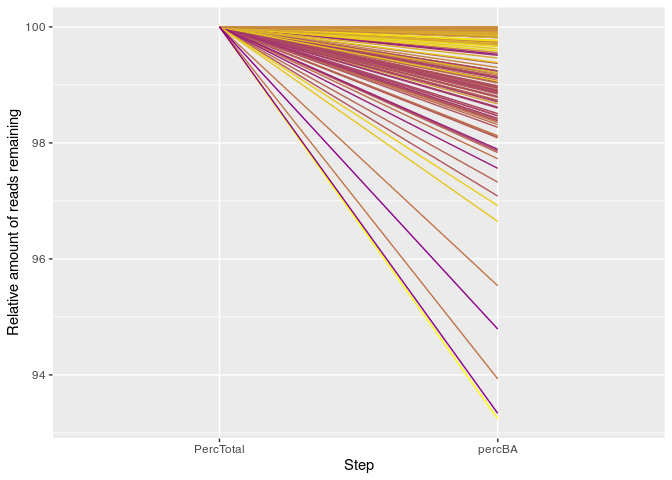
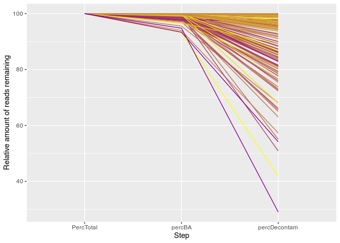
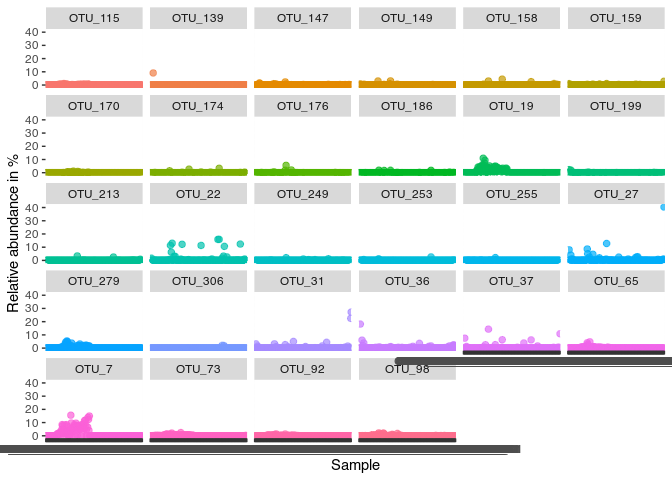
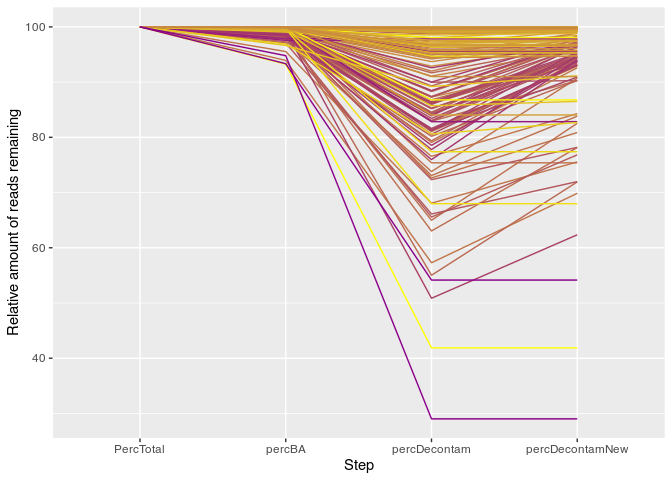
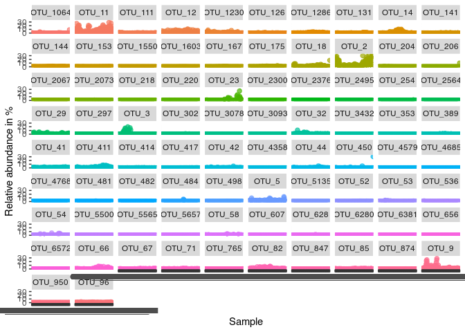
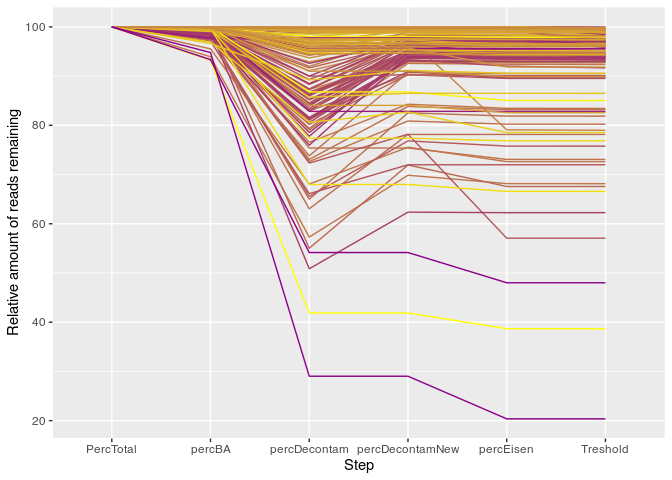
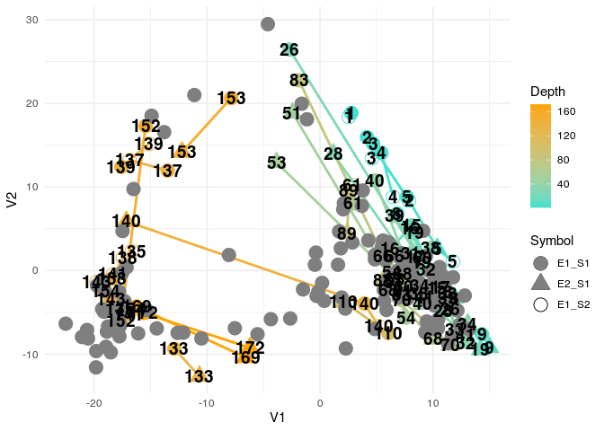

Decontamination and pooling of replicates
================
Sven Le Moine Bauer
2025-03-06

## Introduction

This is the pipeline used to identify and remove contaminants from our
dataset, and then pool/discard sample replicates. The inputs are the
files outputed after the CREST4 command in the previous pipeline.
However, note that in the tax file the leading spaces before each taxa
have been removed. As well, the supertaxa levels have been removed to
keep only Domain, phylum, class, order, family, genus, species.

The pipeline goes through several steps of decontamination:

- Removal of OTUs not assigned to Bacteria or Archaea.
- The frequency approach from the decontam package.
- Removal of a list of known contaminants.
- Removal of OTUs present in the blank.
- Removal of OTUs below a certain abundance threshold.

We however want to have a critic look at each step, to see how it
influences each sample. As such, we ended up modulating the original
plan.

## Loading and preparing the data

Let’s start by loading the libraries and set up the working directory,

``` r
library(reshape2) # Used to transform tables
library(ggplot2) # Used to plot data
library(phyloseq) # Used to play around with OTU tables
library(decontam) # Decontamination package
library(dplyr) # Used to play with the data

# Set directory
setwd(dirname(rstudioapi::getActiveDocumentContext()$path)) # Sets the directory to the place the script is saved.
```

Now we can import the data. Change the location of the directory
accordingly. They structure here is the one of the Github.

``` r
OTUtable <- read.csv("./Input/Otutab_curated.sorted.tsv", row.names=1, sep = "\t")
Metatable <- read.csv("./Input/MetadataDecontamPooling.csv", row.names = 1, sep = ",")
taxtable <- read.csv("./Input/assignments.csv", row.names = 1, sep = "\t")
```

The taxonomic output of CREST4 keeps empty cells when there is no
taxonomic assignment. This will be problematic when pooling at higher
taxonomic levels as all the unassigned taxa may be pooled together
regardless of their higher taxonomy. Therefore we will replace all empty
cells with Unassigned_XXX. XXX being the last assigned level.

``` r
for (i in 1:nrow(taxtable)){taxtable[i,] <- as.character(taxtable[i,])}
for (i in 1:nrow(taxtable)){
  if (taxtable[i,2] == ""){
    phylum <- paste("Unclassified_", taxtable[i,1], sep = "")
    taxtable[i, 2:7] <- phylum
  } else if (taxtable[i,3] == ""){
    class <- paste("Unclassified_", taxtable[i,2], sep = "")
    taxtable[i, 3:7] <- class
  } else if (taxtable[i,4] == ""){
    order <- paste("Unclassified_", taxtable[i,3], sep = "")
    taxtable[i, 4:7] <- order
  } else if (taxtable[i,5] == ""){
    family <- paste("Unclassified_", taxtable[i,4], sep = "")
    taxtable[i, 5:7] <- family
  } else if (taxtable[i,6] == ""){
    genus <- paste("Unclassified_", taxtable[i,5], sep = "")
    taxtable[i, 6:7] <- genus
  } else if (taxtable[i,7] == ""){
    species <- paste("Unclassified_", taxtable[i,6], sep = "")
    taxtable[i, 7] <- species
  }
}
rm(i, class, family, genus, order, phylum, species) # Some cleanup
```

Time to make a phyloseq object, as well as a version of it with relative
abundances.

``` r
OTU = otu_table(as.matrix(OTUtable), taxa_are_rows = TRUE)
TAX = tax_table(as.matrix(taxtable))
samples = sample_data(Metatable)
GC10 <- phyloseq(OTU, TAX, samples)
GC10_rel <- transform_sample_counts(GC10, function(x) x/sum(x)) # The version with relative abundance.
```

And I also create a table that will be filled over time with how many
reads remain for each samples after each decontamination step.

``` r
counts <- data.frame(sample_sums(GC10))
counts$Sample <- rownames(counts)
counts$depth <- Metatable$Depth
counts$PercTotal <- 100
```

## Remove OTUs that are not Archaea or Bacteria

The strategy is to remove any taxa from the phyloseq object that are not
assigned to Archaea or Bacteria at the Domain level.

``` r
GC10_BA <- subset_taxa(GC10, Domain %in% c("Archaea", "Bacteria"))
GC10_rel_BA  <- subset_taxa(GC10_rel, Domain %in% c("Archaea", "Bacteria"))
```

Let see how much this impacted the different samples.

``` r
counts$percBA <- sample_sums(GC10_BA)*100/counts$sample_sums.GC10. # add the percentage remaining to the count table
Counts_long <- melt(counts[,2:5]) # ggplot likes long tables...
ggplot(Counts_long, aes(x = variable, y = value, group = Sample, color = depth)) + geom_path() + scale_color_manual(values =colorRampPalette(colors = c("yellow", "magenta 4"))(175)) + labs(x = 'Step', y = 'Relative amount of reads remaining') + theme(legend.position = "None")
```

<!-- -->

It seems that the shallowest samples (in yellow) are less impacted than
the deeper ones (in red), but no samples are loosing more than 6% of
their reads, so all good.

## Decontam package

Here we use only the frequency approach of the
[decontam](https://www.bioconductor.org/packages/devel/bioc/vignettes/decontam/inst/doc/decontam_intro.html)
package, because we do not have enough blanks for the prevalence
approach. We used the sum of archaeal and bacterial 16S qPCR measurement
as our quantitative information for each sample.

``` r
GC10_BA_samples <- subset_samples(GC10_BA, Type=="Sample")
# Runs the frequency approach from decontam.
contamdf.freq <- isContaminant(GC10_BA_samples, method="frequency", conc = "Proka16S") 
#How many contaminants?
table(contamdf.freq$contaminant) 
```

    ## 
    ## FALSE  TRUE 
    ##  7870   203

``` r
# Which OTUs are contaminants?
List_contam <- rownames(contamdf.freq[contamdf.freq$contaminant == TRUE,]) 
# Which OTUs are not contaminants?
List_decontam <- rownames(contamdf.freq[contamdf.freq$contaminant == FALSE,]) 
# Remove contaminants from phyloseq objects.
GC10_decontam <- prune_taxa(List_decontam, GC10_BA)
GC10_rel_decontam  <- prune_taxa(List_decontam, GC10_rel_BA) 
```

Let’s have a look at the impact on each sample, using the count table.

``` r
counts$percDecontam <- sample_sums(GC10_decontam)*100/counts$sample_sums.GC10.
Counts_long <- melt(counts[,2:6])
ggplot(Counts_long, aes(x = variable, y = value, group = Sample, color = depth)) + geom_path() + scale_color_manual(values =colorRampPalette(colors = c("yellow", "magenta 4"))(175)) + labs(x = 'Step', y = 'Relative amount of reads remaining') + theme(legend.position = "None")
```

<!-- -->

Some samples are loosing nearly 60% of their reads, especially in the
deeper samples again. That seems really heavy. It could be that some
OTUs were wrongly flagged as contaminants. Indeed the frequency approach
is based on the idea that contaminants are relatively more abundant in
low biomass samples. While this is likely true, this is also the case of
many of our anaerobic taxa that are mainly present in the deeper anoxic
layers with low biomass. So let’s look at the most abundant OTUs
considered as contaminants.

``` r
# Select only the OTUs that are considered as contaminants
GC10_rel_contam  <- prune_taxa(List_contam, GC10_rel_BA) 
# Keep the OTUs that are doing at least 5% cumulative relative abundance.
GC10_rel_contam_top <- prune_taxa(taxa_sums(GC10_rel_contam) > 0.05, GC10_rel_contam)
# Run this line to see what are the names of the main contaminants
tax_table(GC10_rel_contam_top)[,6] 
# Get a long version of the phyloseq object
GC10_rel_contam_top_melt <- psmelt(GC10_rel_contam_top) 
ggplot(GC10_rel_contam_top_melt, aes(Sample, Abundance*100, color = OTU)) +
  geom_point(size = 2, alpha = 0.7) +
  ylab('Relative abundance in %') +
  facet_wrap(~OTU) + theme(legend.position="none")
```

<!-- -->

The plot above gives the relative abundance of the main contaminants in
each sample. We can see that for example OTU_27 represents 40% of one
sample. To assess if I want to reintegrate a contaminant, I look at the
following:  
- The quantity: I expect contaminants to not completely dominate some
community compositions.  
- The distribution: A contaminant would be likely randomly distributed
with depth. OTU_19 or OTU_7 for example seem to have a biologically
logical distribution and therefore are likely not contaminant.  
- The taxonomy of the OTUs.

**Results:**  
OTU_7 “Unclassified_SAR324 clade(Marine group B)”: Likely not a
contaminant.  
OTU_19 “Unclassified_Marinimicrobia (SAR406 clade)”: Likely not a
contaminant.  
OTU_22 “Unclassified_Xanthobacteraceae”: Contaminant.  
OTU_27 “Unclassified_Gammaproteobacteria”: Blasting the sequence gives a
100% ecoli. Contaminant.  
OTU_31 “Methylobacterium-Methylorubrum”: Could indeed be a
contaminant.  
OTU_36 “Sphingomonas”: Hard to say, but the distribution makes it look
like a contaminant.  
OTU_37 “Methylobacterium-Methylorubrum”: Could indeed be a
contaminant.  
OTU_65 “Unclassified_Marinimicrobia (SAR406 clade)”: Likely not a
contaminant.  
OTU_72 “Unclassified_3051bac4-16”: Likely not a contaminant.  
OTU_73 “Unclassified_Marinimicrobia (SAR406 clade)”: Likely not a
contaminant.  
OTU_92 “Haliangium”: Likely not a contaminant.  
OTU_98 “Unclassified_SAR202 clade”: Likely not a contaminant.  
OTU_115 “Unclassified_Ardenticatenales”: a bit weird, but OK, still
marine.  
OTU_139 “Solirubrobacter”: Contaminant.  
OTU_147 “Staphylococcus”: Contaminant.  
OTU_149 “Unclassified_Corynebacteriaceae”: Contaminant.  
OTU_158 “Micrococcus”: Contaminant.  
OTU_159 “Unclassified_Microbacteriaceae”: Hard to say, but due to the
distribution I would rather say a contaminant.  
OTU_170 “Unclassified_Marinimicrobia (SAR406 clade)”: Likely not a
contaminant.  
OTU_174 “Unclassified_Micrococcaceae”: Contaminant.  
OTU_176 “Unclassified_GWA2-50-13”: Likely not a contaminant.  
OTU_186 “Unclassified_Caulobacteraceae”: Could be OK, but distribution
is off. Contam.  
OTU_199 “Lactobacillus”: Contaminant, thought the distribution does not
look bad.  
OTU_213 “Unclassified_Corynebacteriaceae”: Contaminant.  
OTU_253 “Cellvibrio”: Contaminant.  
OTU_249 “Ferruginibacter”: Hard to say, but throw away due to the
distribution.  
OTU_255 “Unclassified_SAR202 clade”: Likely not a contaminant.  
OTU_279 “Unclassified_Archaea”: Blasting seems to bring the sequence
within Asgardarchaeota: All good.

So let us update the list of OTUs that are not considered as
contaminants, and update the phyloseq objects

``` r
List_decontam_new <- c(List_decontam, "OTU_7", "OTU_65", "OTU_73", "OTU_92", "OTU_98", "OTU_115", "OTU_170", "OTU_176", "OTU_279", "OTU_306")
# Remove this list of OTUs from the dataset.
GC10_decontam <- prune_taxa(List_decontam_new, GC10_BA) 
GC10_rel_decontam  <- prune_taxa(List_decontam_new, GC10_rel_BA)
```

Let’s look at the impact on the samples this time.

``` r
counts$percDecontamNew <- sample_sums(GC10_decontam)*100/counts$sample_sums.GC10.
Counts_long <- melt(counts[,2:7])
ggplot(Counts_long, aes(x = variable, y = value, group = Sample, color = depth)) + geom_path() + scale_color_manual(values =colorRampPalette(colors = c("yellow", "magenta 4"))(175)) + labs(x = 'Step', y = 'Relative amount of reads remaining') + theme(legend.position = "None")
```

<!-- -->

Most samples are now less impacted, but this step is still a heavy one
for many samples. At least now I feel confident about it.

## Remove list of known contaminant

This is based on the paper from [Eisenhofer
(2019)](https://pubmed.ncbi.nlm.nih.gov/30497919/), where there is a
list of known lab contaminants. The main idea is to remove all OTUs
which genus taxonomic assignment is present in this list. Note that this
list is originally made for the medical field, not for the environmental
field.

``` r
Eisenhofer <- c('Actinomyces', 'Corynebacterium', 'Arthrobacter', 'Rothia', 'Propionibacterium', 'Atopobium', 'Sediminibacterium', 'Porphyromonas', 'Prevotella', 'Chryseobacterium', 'Capnocytophaga', 'Chryseobacterium', 'Flavobacterium', 'Pedobacter', 'UnclassifiedTM7', 'Bacillus', 'Geobacillus', 'Brevibacillus', 'Paenibacillus', 'Staphylococcus', 'Abiotrophia', 'Granulicatella', 'Enterococcus', 'Lactobacillus', 'Streptococcus', 'Clostridium', 'Coprococcus', 'Anaerococcus', 'Dialister', 'Megasphaera', 'Veillonella', 'Fusobacterium', 'Leptotrichia', 'Brevundimonas', 'Afipia', 'Bradyrhizobium', 'Devosia', 'Methylobacterium', 'Mesorhizobium', 'Phyllobacterium', 'Rhizobium', 'Methylobacterium', 'Phyllobacterium', 'Roseomonas', 'Novosphingobium', 'Sphingobium', 'Sphingomonas', 'Achromobacter', 'Burkholderia', 'Acidovorax', 'Comamonas', 'Curvibacter', 'Pelomonas', 'Cupriavidus', 'Duganella', 'Herbaspirillum', 'Janthinobacterium', 'Massilia', 'Oxalobacter', 'Ralstonia', 'Leptothrix', 'kingella', 'Neisseria', 'Escherichia', 'Haemophilus', 'Acinetobacter', 'Enhydrobacter', 'Pseudomonas', 'Stenotrophomonas', 'Xanthomonas')
GC10_Eisen <- subset_taxa(GC10_decontam, !Genus %in% Eisenhofer)
GC10_rel_Eisen <- subset_taxa(GC10_rel_decontam, !Genus %in% Eisenhofer)
```

Once more, let’s have a look at the impact on each sample, using the
count table.

``` r
counts$percEisen <- sample_sums(GC10_Eisen)*100/counts$sample_sums.GC10.
Counts_long <- melt(counts[,2:8])
ggplot(Counts_long, aes(x = variable, y = value, group = Sample, color = depth)) + geom_path() + scale_color_manual(values =colorRampPalette(colors = c("yellow", "magenta 4"))(175)) + labs(x = 'Step', y = 'Relative amount of reads remaining') + theme(legend.position = "None")
```

<!-- -->

## Remove OTUs present in the blank

Similarly to the previous step, I want to remove all OTUs present in the
blank. First, let’s get the list of OTUs present in the blank.

``` r
OTUblank <- taxa_names(subset_taxa(GC10_Eisen,taxa_sums(subset_samples(GC10_Eisen, sample_names(GC10_Eisen) %in% c('GS19_GC10_B1_E2_S1', "GS19_GC10_B2_E2_S1"))) >0))
```

Let’s have a look at the abundance of these OTUs in all samples.

``` r
GC10_Eisen_rel_blank <- prune_taxa(OTUblank, GC10_rel_Eisen)
GC10_Eisen_rel_blank_melt <- psmelt(GC10_Eisen_rel_blank)
ggplot(GC10_Eisen_rel_blank_melt, aes(Sample, Abundance*100, color = OTU)) +
  geom_point(size = 2, alpha = 0.7) +
  ylab("Relative abundance in %") +
  facet_wrap(~OTU) + theme(legend.position="none")
```

<!-- -->

We can see here that many of our top OTUs are present here and it does
not really make sense in my mind to remove the OTUs from the blanks.
Seems rather that we have a low level of cross contamination.

## Remove OTUs below a certain abundance treshold

This is based on [Bokulich
(2012)](https://www.nature.com/articles/nmeth.2276), but I had to
decrease the threshold, because removing the OTUs not covering 0.005% of
all sequences as advised in the paper is far too high. Therefore I only
remove OTUs that are not represented by at least 10 sequences. While
this is compositionally not really correct, and some OTUs may be at a
disadvantage here, I ll just close my eyes on this one… The consequences
are probably minimal anyway.

``` r
GC10_treshold <- prune_taxa(taxa_sums(GC10_Eisen)>10, GC10_Eisen)
```

As usual, let’s look at the influence on the samples

``` r
counts$Treshold <- sample_sums(GC10_treshold)*100/counts$sample_sums.GC10.
Counts_long <- melt(counts[,2:9])
ggplot(Counts_long, aes(x = variable, y = value, group = Sample, color = depth)) + geom_path() + scale_color_manual(values =colorRampPalette(colors = c("yellow", "magenta 4"))(175)) + labs(x = 'Step', y = 'Relative amount of reads remaining') + theme(legend.position = "None")
```

<!-- -->

``` r
GC10_Eisen
```

    ## phyloseq-class experiment-level object
    ## otu_table()   OTU Table:         [ 7779 taxa and 225 samples ]
    ## sample_data() Sample Data:       [ 225 samples by 10 sample variables ]
    ## tax_table()   Taxonomy Table:    [ 7779 taxa by 7 taxonomic ranks ]

``` r
GC10_treshold
```

    ## phyloseq-class experiment-level object
    ## otu_table()   OTU Table:         [ 5344 taxa and 225 samples ]
    ## sample_data() Sample Data:       [ 225 samples by 10 sample variables ]
    ## tax_table()   Taxonomy Table:    [ 5344 taxa by 7 taxonomic ranks ]

The step does not seem to have a too strong impact, except on a couple
of samples, and it removes 30% of all OTUs in the dataset, simplifying
it a lot. I will keep it like that for downstream analysis.

## Conclusions of the decontamination

So after this pipeline we have changed a bit the original
decontamination plan.

- We removed OTUs not assigned to Archaea or Bacteria at the Domain
  level.
- We removed some OTUs through the decontam package, but kept some
  important flagged OTUs, as they did not looked like contaminants.
- We removed a list of known contaminants.
- We kept the OTUs that were in our blank, as they do not seem to be
  linked to external contaminations.
- We removed OTUs that are not represented by a minimum of 10 reads.

The important message here is that it is always important to
double-check how any function/algorithm influences the samples. The
consequences can be very important for some samples.

Note that the fasta file still has 8218 OTUs. So one needs to remove the
OTUs that are not in the OTU table.

At this point we are done with the decontamination pipeline, and are
ready to look into the pooling of the replicates.

## Pooling of samples

Now, we need to decide what we do with our replicates. We have in total
50 replicates, sometimes from a different DNA extraction (then having
the suffix E2 in the name) and sometimes from a new sequencing run (then
getting the suffix S2 in the name). Typically we produced replicates in
order to compensate for low amount of reads, or outliers on the qPCR or
sequencing data. Our choices are then to select only one of the
replicates, or to pool them together. The strategy is to look into the
compositional dissimilarity (through a PCA), the qPCR data, and the
amount of read to make an arbitrary choice.

First, we need the `mBiplext` function from JuanJo Egozcue to do a CoDA
PCA plot.

``` r
source("./Input/mBiplext.R")
```

We will do the analysis at the family level, in order to decrease the
amount of 0s in the dataset, which is an issue when using log ratios as
in the clr transformation. Then we impute the zeros by adding 1
everywere.

``` r
GC10 <- GC10_treshold
# We dont need the blanks anymore
GC10 <- prune_samples(!(sample_names(GC10) %in% c("GS19_GC10_B1_E2_S1", "GS19_GC10_B2_E2_S1")), GC10)
# Pool at the family level
GC10_family <- tax_glom(GC10, taxrank = "Family")
# Get out of phyloseq
OTU_family <- as.data.frame(otu_table(GC10_family))
# Check how many 0s there are in our table. >> 75% 0s, that is still a lot.
mean(unlist(OTU_family) %in% "0") * 100 
# Add +1
OTU_family_noOs <- OTU_family + 1 
# Give the family name to the OTUs, instead of the number.
rownames(OTU_family_noOs) <- tax_table(GC10_family)[,5]
```

Now we can do the PCA.

``` r
# Run the function
PCjuanjo <- mBiplext(t(OTU_family_noOs), extr = NULL, biscale = 0)
```

``` r
#Check how much variance is explained by each PC
(PCjuanjo$D)^2/sum((PCjuanjo$D)^2)
# Export the scores of each sample
PCA_scores <- as.data.frame(PCjuanjo$U%*%diag(PCjuanjo$D))[,1:3]
# And give the good names to the rows.
rownames(PCA_scores) <- rownames(sample_data(GC10_family)) 
# Make the metadata table
Metatable <- sample_data(GC10_family)
# Check that the sample order is the same
rownames(PCA_scores) == rownames(Metatable) # Double check
# And add the metadata to the PCA_score table
PCA_scores <- cbind(PCA_scores, Metatable[,c(1,2,4)])
```

And now we can plot the result.

``` r
# Add a grouping variable for Depth
PCA_scores$Group <- ifelse(duplicated(PCA_scores$Depth) | duplicated(PCA_scores$Depth, fromLast = TRUE), "With Line", "No Line")
PCA_scores$Depth <- as.numeric(as.character(PCA_scores$Depth))
PCA_scores$Symbol <- interaction(PCA_scores$Extraction, PCA_scores$Sequencing, sep = "_")

shape_mapping <- c(
  "E1_S1" = 21,   # Filled circle
  "E2_S1" = 24, # Filled triangle
  "E1_S2" = 1      # Circle with edge
)
ggplot(PCA_scores, aes(x = V1, y = V2)) +
  # Lines for connected samples
  geom_line(
    aes(group = Depth, color = Depth),
    data = subset(PCA_scores, Group == "With Line"), linewidth = 1
  ) +
  # Points for samples with lines
  geom_point(
    aes(
      color = Depth, # Edge color
      fill = Depth,  # Fill color
      shape = Symbol # Shape based on Extraction and Sequencing
    ),
    data = subset(PCA_scores, Group == "With Line"),
    size = 5
  ) +
  # Points for samples without lines (gray)
  geom_point(
    data = subset(PCA_scores, Group == "No Line"),
    aes(shape = Symbol),
    color = "grey50",
    fill = "grey50", # Ensure these are white-filled if using filled shapes
    size = 5
  ) +
  # Labels for depths on points with lines
  geom_text(
    data = subset(PCA_scores, Group == "With Line"),
    aes(label = Depth),
    nudge_y = 0.02,
    size = 5,
    fontface = "bold"
  ) +
  # Scales for color and shapes
  scale_color_gradient(low = "turquoise", high = "orange", na.value = "grey50") +
  scale_fill_gradient(low = "turquoise", high = "orange", na.value = "grey50") +
  scale_shape_manual(values = shape_mapping) + # Use shape mapping defined earlier
  theme_minimal() +
  labs(color = "Depth", fill = "Depth", shape = "Symbol")
```

<!-- -->

I will not go in more detail here about the choices that we made to pool
or discard the samples. For this information, please look into the
supplementary material 2. The following code chunks explain how the data
was merged or selected. For reasons explained in the supplementary
material 2, we decide to use the average of relative abundance when
pooling replicates. So first we want to get the OTU table as relative
abundance.

``` r
# The version with relative abundance.
GC10_rel <- transform_sample_counts(GC10, function(x) x/sum(x))
# Get out of phyloseq
OTU_GC10 <- as.data.frame(otu_table(GC10_rel))
```

The information about what happens to each replicate can be found in the
Metatable data. Therefore, all what remained to do was having the
following function to read the table and apply the modifications to the
OTU table.

``` r
process_otu_table <- function(OTU_table, Metatable) {
  # Ensure sample order matches between OTU_table (columns) and Metatable (rows)
  if (!all(colnames(OTU_table) %in% rownames(Metatable))) {
    stop("Column names of OTU_table must match row names of Metatable.")
  }
  
  # Get unique depths with potential replicates
  depths_with_replicates <- unique(Metatable$Depth[duplicated(Metatable$Depth)])
  
  # Initialize the new OTU table
  new_OTU_table <- OTU_table
  
  for (depth in depths_with_replicates) {
    # Get samples corresponding to the current depth
    samples_at_depth <- rownames(Metatable[Metatable$Depth == depth, ])
    pooling_choices <- Metatable$PoolingChoice[Metatable$Depth == depth]
    
    if ("keep" %in% pooling_choices) {
      # If "keep" exists, select only the samples with "keep"
      keep_samples <- samples_at_depth[pooling_choices == "keep"]
      # Subset the OTU table to retain only the "keep" samples
      new_OTU_table <- new_OTU_table[, !(colnames(new_OTU_table) %in% setdiff(samples_at_depth, keep_samples))]
    } else if (all(pooling_choices == "pool")) {
      # If all are "pool", calculate the mean across these samples
      pooled_mean <- rowMeans(OTU_table[, samples_at_depth, drop = FALSE])
      
      # Derive the new pooled sample name from the first sample at this depth
      original_name <- samples_at_depth[1]
      new_colname <- sub("E\\d+_S\\d+$", "pooled", original_name)  # Replace "Ex_Sx" with "pooled"
      
      # Add the averaged column as the representative for this depth
      new_OTU_table <- cbind(new_OTU_table, setNames(data.frame(pooled_mean), new_colname))
      # Remove the original columns corresponding to these samples
      new_OTU_table <- new_OTU_table[, !(colnames(new_OTU_table) %in% samples_at_depth)]
    }
  }
  
  return(new_OTU_table)
}

OTU_table_pooled <- process_otu_table(OTU_GC10, Metatable)
```

Good, now we do have and OTU table with 173 samples, as expected. But
now, we need to select which qPCR data we are going to keep for samples
having E1 and E2. This is done by looking at the qPCR data plotted and
make an arbitrary choice. We do not want to average both measurements as
this will play with the uncertainty, which is an important aspect in
this study. Supplementary material 3 explains the selection. Concretely,
for samples 32, 39, 40, 152, 153, 154, we will keep the E2 value.

``` r
# List of depths to check for E2 >> I add 69 because we actually never qPCRed  E1... forgot.
depths_for_E2 <- c(32, 39, 40, 69, 152, 153, 154)

filtered_metatable <- Metatable %>% data.frame() %>%
  filter((Depth %in% depths_for_E2 & Extraction == "E2") | 
           (!Depth %in% depths_for_E2 & Extraction == "E1")) %>%
  group_by(Depth) %>%
  filter((n() == 1) | (Sequencing == "S1")) %>%
  ungroup()
```

Voila. At this point there is a bit more aesthetics changes to do, like
changing the samples name, but the dataset is processed, decontaminated,
cleaned, and ready to be used downstream.
