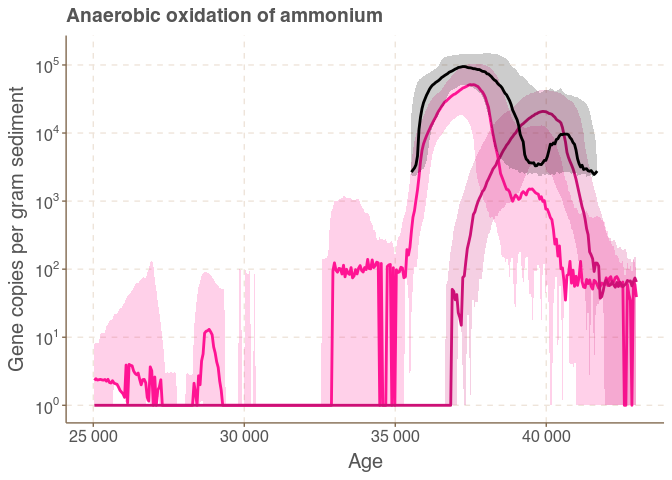

Plotting
================
Sven Le Moine Bauer
2025-03-19

## Introduction

Now we have produced all the data needed in Julia, and we are ready to
plot it in R. Again, I will show only the anammox part, but it is
similar for the other plots. Let’s import everything.

``` r
library(scales)
library(ggplot2)
library(ggthemr)

# Set director
setwd(dirname(rstudioapi::getActiveDocumentContext()$path)) # Sets the directory to the place the script is saved.
data <- read.csv("./Input/Anammox_KDE.csv", sep = ",")
```

## Plotting

And here is the result

``` r
ggthemr("fresh")
ggplot(data) +
  geom_ribbon(aes(x = Age, ymin = OTU_3_LowerQuantile, ymax = OTU_3_UpperQuantile), fill = "#FF1493", alpha = 0.2) +  # Confidence interval as a shaded area
  geom_line(aes(x = Age, y = OTU_3_Median), color = "#FF1493", size = 1) +
  geom_ribbon(aes(x = Age, ymin = OTU_16_LowerQuantile, ymax = OTU_16_UpperQuantile), fill = "deeppink3", alpha = 0.2) +  # Confidence interval as a shaded area
  geom_line(aes(x = Age, y = OTU_16_Median), color = "deeppink3", size = 1) +
  geom_ribbon(aes(x = ifelse(Age >= 35500 & Age <= 41700, Age, NA), ymin = hzo_LowerQuantile, ymax = hzo_UpperQuantile), fill = "black", alpha = 0.2) +  # Confidence interval as a shaded area
  geom_line(aes(x = ifelse(Age >= 35500 & Age <= 41700, Age, NA), y = hzo_Median), color = "black", size = 1) +
 scale_y_continuous(
    trans = "log10",
    breaks = scales::trans_breaks("log10", function(x) 10^x),  # Ensure breaks are in powers of 2
    labels = scales::trans_format("log10", math_format(10^.x)) # Format labels as 2^x
  ) +
  scale_x_continuous(limits = c(25000, 43000),
                     labels = label_number(big.mark = " ")) +
  labs(x = "Age", y = "Gene copies per gram sediment", title = "Anaerobic oxidation of ammonium") +
  theme(axis.text = element_text(size = 12),
        axis.title = element_text(size = 15))
```

<!-- -->
